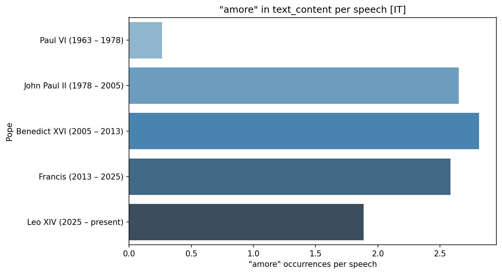
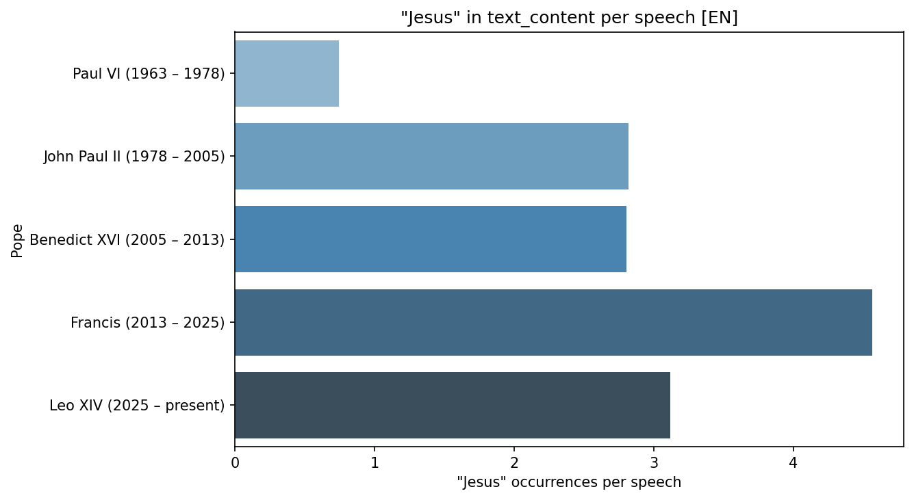
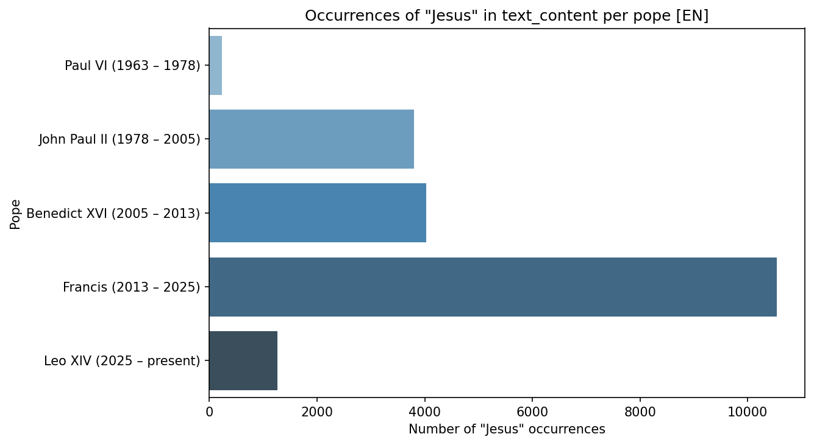
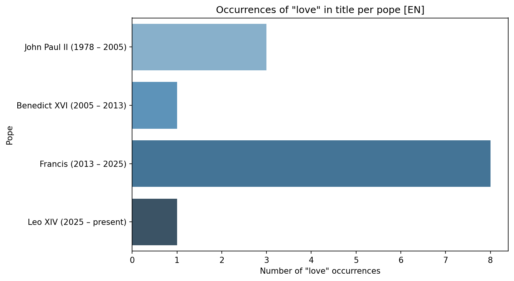
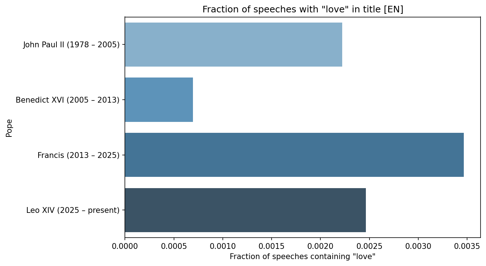
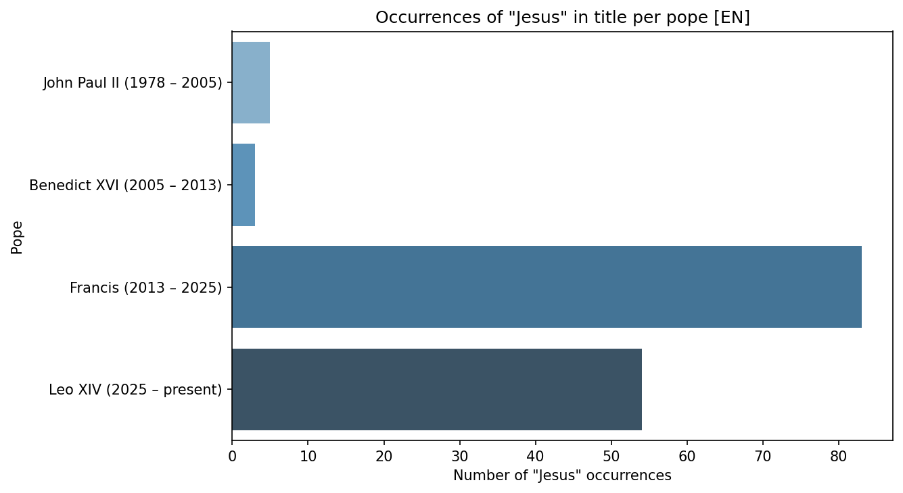

# Word frequency across five pontificates

How often do popes reach for a given word? These figures compare "love" and
"Jesus" in English and "amore" in Italian across Paul VI, John Paul II,
Benedict XVI, Francis and Leo XIV.

!!! warning "These figures come from a wider corpus than the one in `data.md`"
    They cover **five** pontificates back to 1963. The reference build
    documented in [The Data](../data.md) contains only Francis and Leo XIV, so
    running `create_example_plots` against it today reproduces the same charts
    with two bars, not five. Scrape the earlier popes to regenerate them in
    full:

    ```bash
    uv run -m dc26_vatican_explorer.vatican_scraper.step06_run_scraping_pipeline \
        --popes "Benedict XVI,John Paul II,Paul VI" \
        --years "1963-2013" --section "angelus,homilies,speeches" --lang "EN,IT"
    ```

## How much each pope said

Every rate below divides by this. Francis dominates the corpus, and Paul VI is
barely present in it.


Paul VI reigned fifteen years but contributes about 310 English documents,
against roughly 1,350 for John Paul II's twenty-seven. The Vatican website is
not an even historical record — the further back you go, the less of a
pontificate was digitised and translated. Read every Paul VI bar below with
that in mind.

## Rates: the comparable view

Dividing occurrences by number of documents removes the length of a
pontificate from the comparison.

### "love" in English


### "amore" in Italian



These two are the most interesting pair on the page, because they are
independent measurements that agree. English and Italian are scraped as
separate passes over separate index pages, yet both rank the popes the same
way: Paul VI lowest by a wide margin, then Leo XIV, then Francis and John Paul
II close together, with Benedict XVI highest.

Two corpora in two languages producing the same ordering is a reasonable sign
the signal is real and not an artefact of one translation pipeline.

### "Jesus" in English



Here the pattern breaks, and it is the clearest single result on the page.
Francis says "Jesus" about **4.6 times per document, against 2.8 for both
Benedict XVI and John Paul II** — roughly 60% more than either. Benedict, who
led on "love", is unremarkable on "Jesus".

This is consistent with the [scripture heatmap](../findings.md#3-both-popes-preach-almost-entirely-from-the-new-testament),
where Francis leans noticeably harder on Mark, the most narrative of the
Gospels.

## Raw counts: dominated by tenure





Francis towers over everyone — 10,500 occurrences of "Jesus" against Benedict's
4,000. That is very close to being a restatement of the first chart on this
page. A pope with three times the documents will generally have three times the
word occurrences, so these totals mostly measure how long someone reigned and
how much of it was published. They are here for completeness; the rate charts
are the ones that carry an argument.

## Titles: too few to interpret







!!! danger "Do not read these as findings"
    The underlying counts are **1, 3 and 8 documents**. The fraction chart's
    axis runs to 0.0035 — roughly three speeches in a thousand. At that scale a
    single differently-worded title moves a bar by a third, and Paul VI drops
    off the chart entirely because his count is zero.

    Titles on vatican.va are editorial descriptions ("To the Members of the
    Diplomatic Corps"), not the pope's own words, so they were never a
    promising place to look for rhetoric. Kept here as an honest negative
    result.

## Regenerating

```bash
uv run -m dc26_vatican_explorer.plotting_tools.create_example_plots
```

Figures are written to `outputs/example_plots/` (gitignored). The functions
behind them — `plot_speech_count_per_pope`, `plot_word_count_per_pope` and
`plot_word_rate_per_pope` — take any search word, language and field, so the
same three charts can be produced for any term in the corpus.
