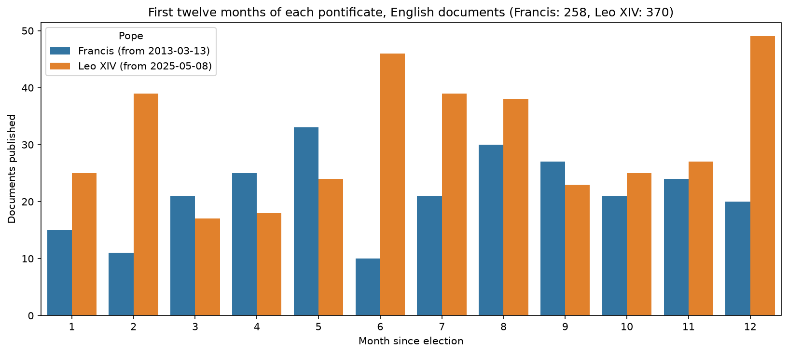
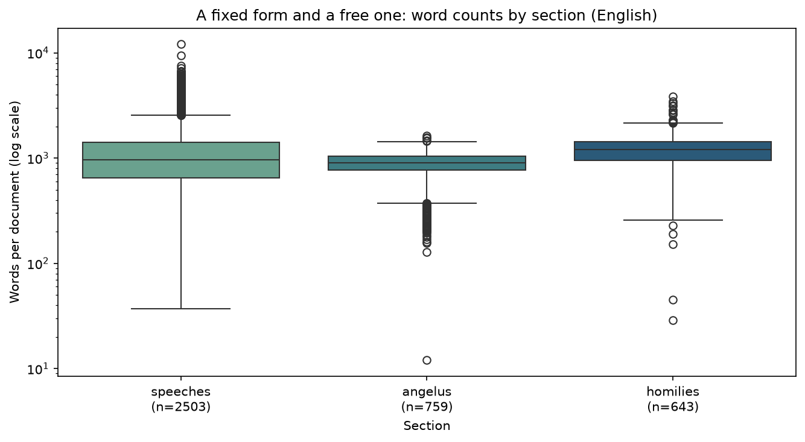

# Findings

Four things the corpus says, and one thing it took a bug fix to be able to say
at all. Every figure here is regenerated from the database by a single command:

```bash
uv run -m dc26_vatican_explorer.plotting_tools.story_plots
```

## 1. The audiences stopped; the Angelus did not


A pope's public output is not one activity but two, and the pandemic separated
them cleanly.

Counting English documents in the March–August window of four consecutive
years:

| Mar–Aug | Speeches & homilies | Angelus |
|---|---:|---:|
| 2019 | 105 | 27 |
| **2020** | **12** | **29** |
| 2021 | 45 | 26 |
| 2022 | 116 | 26 |

Addresses and homilies fell by **89%**. The Angelus went *up* by two.

The asymmetry is the point. Audiences, state visits and canonisations require
an audience; when Saint Peter's Square closed, they simply stopped, and the
line sits at zero for April, May, July and August 2020. The Sunday Angelus
requires only a window, and Francis kept it every week, streamed from the
Apostolic Palace library. One calendar is contingent on the world; the other is
liturgical, and it did not miss a Sunday.

The recovery is visible too, and it is slow: 2021 recovers only to 45, still
well under half of 2019, before 2022 overshoots 2019 entirely.

!!! note "The summer dip is real, not missing data"
    Every year shows a July–August trough. That is the papal summer break, not
    a gap in the scrape — the Angelus line continues through it.

## 2. Leo XIV opened louder than Francis



Comparing career totals across a twelve-year and a one-year pontificate
measures longevity, not temperament. Aligning both on months-since-election
gives the only honest comparison the corpus supports.

In their first twelve months, in English: **Francis 258 documents, Leo XIV
370** — 43% more. Leo leads in eight of the twelve months.

!!! warning "One confound worth naming"
    This compares 2013–14 against 2025–26, so it also compares how much the
    Vatican website published and translated in each era. Some of the gap may
    be editorial practice rather than papal activity. The finding is real but
    it is not cleanly attributable to the men.

## 3. Both popes preach almost entirely from the New Testament


Scanning 7,808 documents for citations like `Jn 3:16` or `Matthew 5:9` and
resolving each abbreviation against `data/bible_books.csv` yields roughly 7,200
resolved citations across 64 books.

The distribution is extremely concentrated. **84% of citations are New
Testament**, and the four Gospels alone account for over half of everything.
Both popes show the same shape.

Two differences survive normalisation:

- **Leo cites more densely overall** — 224 citations per 100 documents against
  Francis's 179.
- **Francis reaches for Mark almost twice as often** — 11.5 per 100 documents
  against Leo's 6.9 — while Leo leans harder on Matthew and John. This is the
  one place the two profiles genuinely diverge in shape rather than volume.

Leo's figures rest on 490 documents against Francis's 3,415, so treat the
per-book differences as provisional.

## 4. A fixed form and a free one



| Section | n | Median | IQR | Min | Max |
|---|---:|---:|---:|---:|---:|
| angelus | 759 | 905 | 267 | 12 | 1,641 |
| homilies | 643 | 1,213 | 483 | 29 | 3,852 |
| speeches | 2,503 | 967 | 761 | 37 | 12,163 |

The medians are unremarkable; the *spread* is the finding. The Angelus is a
liturgical slot with a fixed shape — half of them land within 267 words of each
other, and none exceeds 1,641. An address has no such constraint: the same
label covers a 37-word greeting and a 12,163-word document, a range of more
than 300×.

Note the axis is logarithmic. On a linear scale the outliers flatten every box
into a line.

## 5. What the data could not say last week

The four findings above depend on counting documents per month. Until recently
that was impossible, because the scraper truncated the corpus.

`max_n_speeches` was assigned inside the per-year loop, so the first year
scraped set a ceiling for every year after it. Years are walked in ascending
order, so the ceiling was 2013 — Francis's nine-month partial first year.

| Section | Stored (capped) | True 2014 | True 2015 | True 2019 |
|---|---:|---:|---:|---:|
| angelus | 47 every year | 56 | 54 | 56 |
| homilies | 44 every year | 54 | 67 | 56 |
| speeches | 126 every year | 212 | 231 | 220 |

Worse than the undercount: month indexes are traversed newest-first, so the cap
removed the *beginning* of each year. January to April were entirely absent
from most years — which is Lent, Holy Week and Easter. Any analysis of
religious language was silently skewed against the liturgical high season.

Fixing it recovered **1,797 documents, a 30% larger corpus** (6,011 → 7,808),
and turned a suspiciously flat line into the one at the top of this page.

The lesson is dull and worth repeating: a per-year count that never varies is
not a finding, it is a bug. The 2013 numbers looked entirely plausible on their
own.

## Caveats

- English and Italian are scraped as separate passes, so the two languages can
  disagree by a document or two. Join on URL before comparing them.
- `location` is populated for 45% of rows and is not normalised — `Saint
  Peter's Square` and `St Peter's Square` are the same place to a reader and
  two places to a `GROUP BY`.
- The corpus covers Francis and Leo XIV only. Earlier pontificates are
  supported by the scraper but not yet collected, which is why nothing here is
  framed as a long historical trend.
