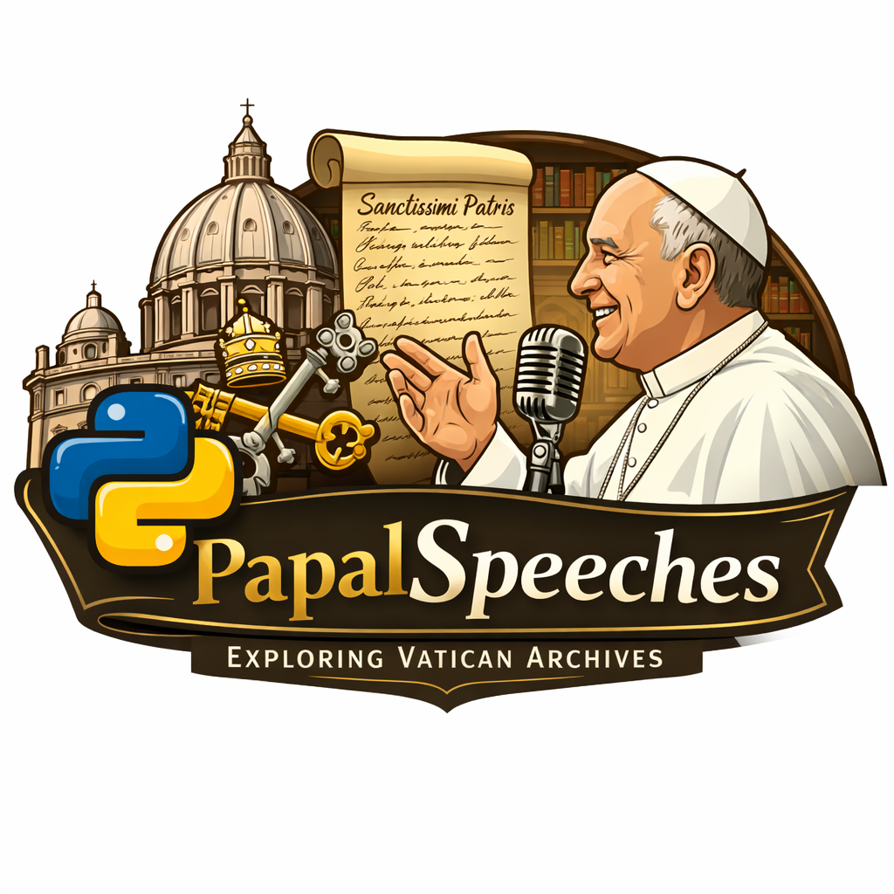
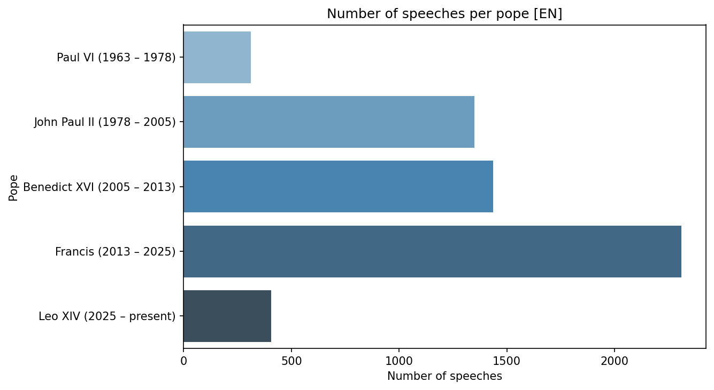
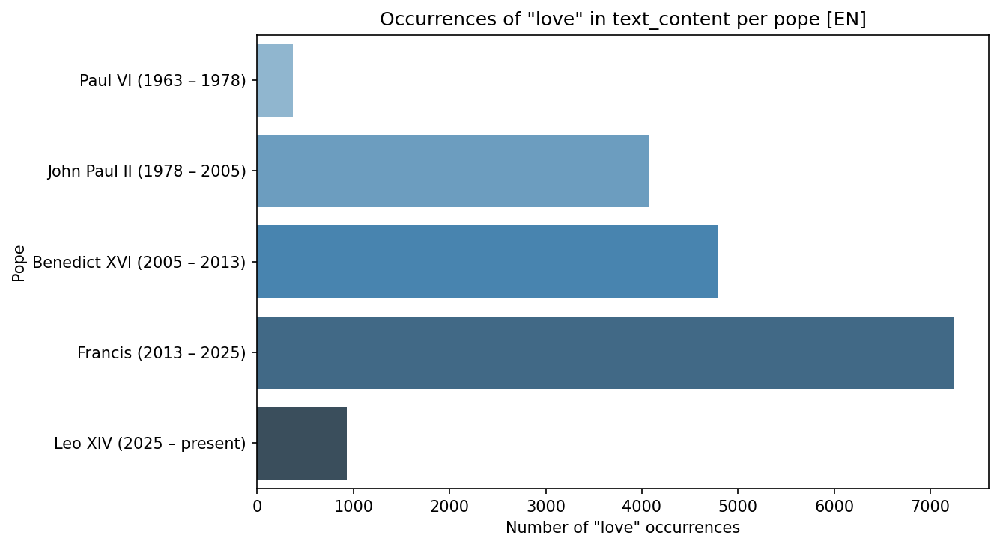
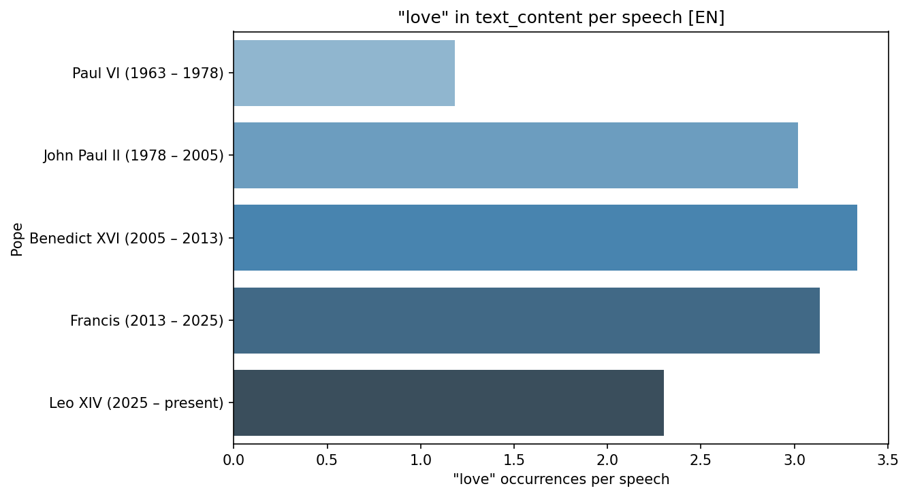
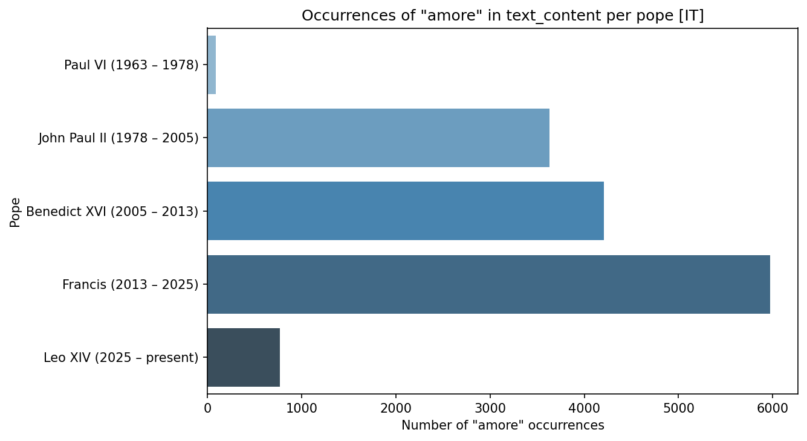

# Vatican Explorer



**Vatican Explorer** is a data-science toolkit for scraping, cleaning, querying, and analyzing the full corpus of papal speeches published on the Vatican's official website (vatican.va). It enables quantitative comparison of rhetorical themes, biblical references, and speech patterns across popes, languages, and time periods.

## Overview

The project covers the full data pipeline:

1. **Scraping** — Systematically collects papal speeches by pope, year, section (e.g., homilies, addresses, angelus), and language (Italian, English, etc.) from vatican.va.
2. **Database** — Stores all collected content in a local SQLite database with tables for popes, speeches, and full text.
3. **Cleaning** — Normalizes dates, extracts metadata from titles, adds birthplace data, and validates the resulting dataset.
4. **Search** — Finds biblical citations within speech texts using regex patterns.
5. **Analysis** — Quantifies word-frequency themes (e.g., "love," "amore," "Jesus") per pope, compares speech volumes, and produces publication-ready visualizations.

## Example Analyses

Below are representative figures generated from the `plotting_tools` module. Each plot compares how different popes use specific words or phrases across their speeches. More detail in [Analyses](analyses/index.md).

!!! note "Read the rates, not the totals"
    Raw counts are dominated by how long a pope reigned and how much of his
    output has been digitised. The *rate* plots, normalised by total speech
    length, are the ones that support a comparison.

### Speech Volume by Pope

How many English speeches did each pope deliver?



### "Love" in English Speeches

Total word count of "love" per pope (text content):



Rate of "love" usage (normalized by total speech length):



### "Amore" in Italian Speeches

Total word count of "amore" per pope in Italian-language texts:



Rate of "amore" usage in Italian:


### "Jesus" in English Speeches

Total word count of "Jesus" per pope in English texts:


### Biblical Citation Analysis

The toolkit can also search for specific biblical references across all speeches. For example, counting mentions of **1 John 4** by year and by pope reveals how different pontiffs engage with particular scriptural passages.

See the full notebook: [Analysis of 1 John 4](analyses/first_john_4.ipynb).

## Getting Started

```bash
# Install dependencies (scraping and dataframe support are opt-in groups)
uv sync --group scrape --group data-manipulation

# Run the full scraping pipeline
uv run -m dc26_vatican_explorer.vatican_scraper.step06_run_scraping_pipeline \
    --popes "Francis,Benedict XVI" \
    --years "2013-2026" \
    --section "angelus,homilies,speeches" \
    --lang "EN,IT"

# Clean and query speech metadata
uv run python -c "
from dc26_vatican_explorer.data_cleaning import get_clean_speech_metadata
data = get_clean_speech_metadata()
print(data)
"
```

See [The Pipeline](pipeline.md) for the full flag reference and a description
of each stage.

## Project Structure

| Directory | Purpose |
|---|---|
| `src/dc26_vatican_explorer/vatican_scraper/` | Multi-step scraper (popes → years → speeches → text → DB) |
| `src/dc26_vatican_explorer/data_cleaning/` | Date normalization, birthplace enrichment, data validation |
| `src/dc26_vatican_explorer/database_utils/` | SQLite helpers, schema checks, query utilities |
| `src/dc26_vatican_explorer/search/` | Biblical citation search with regex patterns |
| `src/dc26_vatican_explorer/pope_comparison/` | Speech quantification and pope profiling |
| `docs/analyses/` | Jupyter notebooks for exploratory analysis, published on this site |
| `data/` | Reference data (`bible_books.csv`) and the local, gitignored `vatican_texts.db` |
| `tests/` | Unit and integration tests |

## Documentation

- [The Pipeline](pipeline.md) — How speeches get from vatican.va into the database
- [The Data](data.md) — Schema, coverage, and how to query it
- [Analyses](analyses/index.md) — Notebooks and findings
- [API Reference](using-vatican-explorer.md) — Full function and class documentation

## Resources

- [Bible text conventions](resources/bible_text.md)
- [Dicastery communication guidelines](resources/communication_dicastery.md)

## About

Vatican Explorer is a **DSSV Data Conclave FY26** project by the RCDS team at [Northwestern University](https://www.northwestern.edu). The live documentation is hosted on GitHub Pages at [rcds-dssv.github.io/dc26-vatican-explorer](https://rcds-dssv.github.io/dc26-vatican-explorer/).
