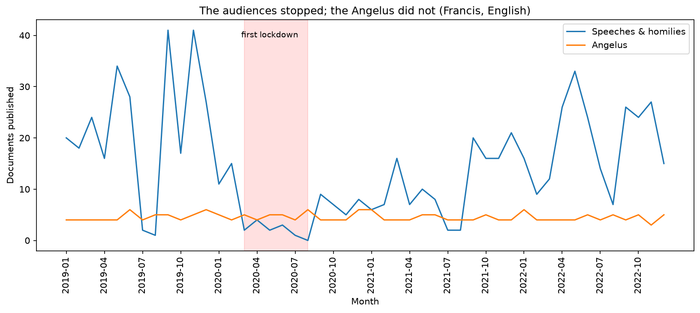
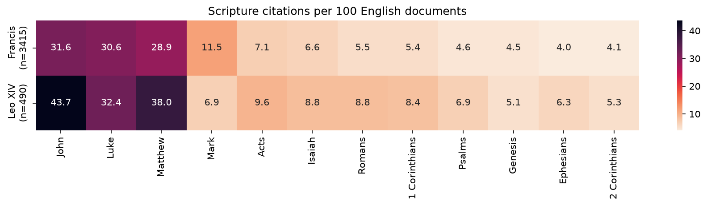

# Vatican Explorer


**Vatican Explorer** is a data-science toolkit for scraping, cleaning, querying, and analyzing the full corpus of papal speeches published on the Vatican's official website (vatican.va). It enables quantitative comparison of rhetorical themes, biblical references, and speech patterns across popes, languages, and time periods.

## Overview

The project covers the full data pipeline:

1. **Scraping** — Systematically collects papal speeches by pope, year, section (e.g., homilies, addresses, angelus), and language (Italian, English, etc.) from vatican.va.
2. **Database** — Stores all collected content in a local SQLite database with tables for popes, speeches, and full text.
3. **Cleaning** — Normalizes dates, extracts metadata from titles, adds birthplace data, and validates the resulting dataset.
4. **Search** — Finds biblical citations within speech texts using regex patterns.
5. **Analysis** — Quantifies word-frequency themes (e.g., "love," "amore," "Jesus") per pope, compares speech volumes, and produces publication-ready visualizations.

## What the data shows

Four results from the current build, each regenerated from the database with a
single command. The full write-up, with caveats, is on the
[Findings](findings.md) page.

### The audiences stopped; the Angelus did not

Between March and August 2020, Francis's speeches and homilies fell 89% (105 to
12) while the Sunday Angelus went *up* by two. Audiences need a crowd; a window
does not.



### Both popes preach almost entirely from the New Testament

Around 7,200 resolved scripture citations across 64 books. 84% are New
Testament, and the four Gospels account for over half of everything. Leo XIV
cites more densely; Francis reaches for Mark nearly twice as often.



### Also on the Findings page

- **[Leo XIV opened louder than Francis](findings.md#2-leo-xiv-opened-louder-than-francis)** — 370 English documents in the first twelve months against 258
- **[A fixed form and a free one](findings.md#4-a-fixed-form-and-a-free-one)** — the Angelus never exceeds 1,641 words; an address ranges from 37 to 12,163
- **[What the data could not say last week](findings.md#5-what-the-data-could-not-say-last-week)** — how a one-line scraper bug hid 30% of the corpus, Lent and Easter included

### Biblical Citation Analysis

The toolkit can also search for specific biblical references across all
speeches. Counting mentions of **1 John 4** by year and by pope shows how
different pontiffs engage with a particular passage.

See the full notebook: [Analysis of 1 John 4](analyses/first_john_4.ipynb).

## Getting Started

```bash
# Install dependencies (scraping and dataframe support are opt-in groups)
uv sync --group scrape --group data-manipulation

# Run the full scraping pipeline
uv run -m dc26_vatican_explorer.vatican_scraper.step06_run_scraping_pipeline \
    --popes "Francis,Benedict XVI" \
    --years "2013-2026" \
    --section "angelus,homilies,speeches" \
    --lang "EN,IT"

# Clean and query speech metadata
uv run python -c "
from dc26_vatican_explorer.data_cleaning import get_clean_speech_metadata
data = get_clean_speech_metadata()
print(data)
"
```

See [The Pipeline](pipeline.md) for the full flag reference and a description
of each stage.

## Project Structure

| Directory | Purpose |
|---|---|
| `src/dc26_vatican_explorer/vatican_scraper/` | Multi-step scraper (popes → years → speeches → text → DB) |
| `src/dc26_vatican_explorer/data_cleaning/` | Date normalization, birthplace enrichment, data validation |
| `src/dc26_vatican_explorer/database_utils/` | SQLite helpers, schema checks, query utilities |
| `src/dc26_vatican_explorer/search/` | Biblical citation search with regex patterns |
| `src/dc26_vatican_explorer/pope_comparison/` | Speech quantification and pope profiling |
| `docs/analyses/` | Jupyter notebooks for exploratory analysis, published on this site |
| `data/` | Reference data (`bible_books.csv`) and the local, gitignored `vatican_texts.db` |
| `tests/` | Unit and integration tests |

## Documentation

- [The Pipeline](pipeline.md) — How speeches get from vatican.va into the database
- [The Data](data.md) — Schema, coverage, and how to query it
- [Analyses](analyses/index.md) — Notebooks and findings
- [API Reference](using-vatican-explorer.md) — Full function and class documentation

## Resources

- [Bible text conventions](resources/bible_text.md)
- [Dicastery communication guidelines](resources/communication_dicastery.md)

## About

Vatican Explorer is a **DSSV Data Conclave FY26** project by the RCDS team at [Northwestern University](https://www.northwestern.edu). The live documentation is hosted on GitHub Pages at [rcds-dssv.github.io/dc26-vatican-explorer](https://rcds-dssv.github.io/dc26-vatican-explorer/).
