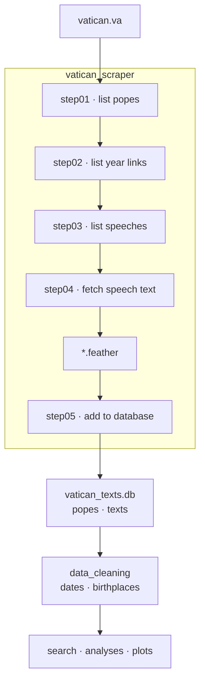

# The Pipeline

Vatican Explorer turns the public speech archive on vatican.va into a queryable
SQLite database. The path from a web page to an analysable row runs through six
scraping steps, then a cleaning stage.



## The scraping steps

Each step is an importable module under `dc26_vatican_explorer.vatican_scraper`,
and each one is independently runnable — useful when a stage fails halfway
through a long scrape.

| Step | Module | What it does |
|---|---|---|
| 1 | `step01_list_popes` | Reads the papal directory and resolves a display name like `"Benedict XVI"` to its site slug. |
| 2 | `step02_list_pope_year_links` | Finds which years a given pope has content for, in a given section. |
| 3 | `step03_list_speeches` | Walks a year index (and its month sub-pages) to collect individual speech URLs. |
| 4 | `step04_fetch_speech_texts` | Downloads each speech, extracts location and body text, follows translation links, writes a Feather file. |
| 5 | `step05_add_to_database` | Upserts each record into SQLite, creating the `popes` row if needed. |
| 6 | `step06_run_scraping_pipeline` | Driver. Runs the cartesian product of popes × sections × languages and reports a success/failure summary. |

Steps 1–4 throttle themselves with a randomised 0.3–0.9 s pause between
requests and retry on transient HTTP errors. A scrape is therefore slow by
design — budget roughly 1.5 requests per second.

## Running it

```bash
uv sync --group scrape --group data-manipulation

uv run -m dc26_vatican_explorer.vatican_scraper.step06_run_scraping_pipeline \
    --popes "Francis,Leo XIV" \
    --years "2013-2026" \
    --section "angelus,homilies,speeches" \
    --lang "EN,IT"
```

!!! tip "Scrapes are resumable"
    `step05` skips URLs that are already stored with content, so re-running the
    same command after an interruption picks up where it left off rather than
    starting over. Start with `--max_n_speeches 5` to verify a new
    pope/section combination before committing to the full run.

Flag reference:

| Flag | Default | Notes |
|---|---|---|
| `--pope` | `Francis` | Repeatable: `--pope Francis --pope "Leo XIV"`. |
| `--popes` | — | Comma-separated alternative to `--pope`. |
| `--years` | `2025` | Accepts `2020`, `2019,2021-2023`, or `2013-2026`. Years a pope has no content for are skipped. |
| `--section` | `angelus` | Comma-separated: `angelus,homilies,speeches`. |
| `--lang` | `EN` | Comma-separated: `EN,IT`. |
| `--max_n_speeches` | none | Caps the number of speeches per combination. Use it for smoke tests. |
| `--out` | auto | Feather filename. Ignored when more than one combination is requested. |

## Cleaning

Dates on vatican.va are inconsistent — some are missing, some appear only in
the speech title, and some predate the pontificate they are filed under.
`data_cleaning.cleaning_pipeline` normalises them:

```python
from dc26_vatican_explorer.data_cleaning import get_clean_speech_metadata

popes = get_clean_speech_metadata(pope_name="Francis")
```

`clean_dates` converts each date to ISO format, falls back to
`extract_date_from_title` when the date field is empty, and drops dates earlier
than the pope's `pontificate_begin`. `rearrange_pope_data` then sorts each
pope's speeches chronologically, with undated entries last.

Birthplaces are not published in a machine-readable form on the site, so
`adding_birthplace.add_birthplace_to_db` enriches the `popes` table from a
hand-curated map.

See the [API Reference](using-vatican-explorer.md) for the full signatures.
